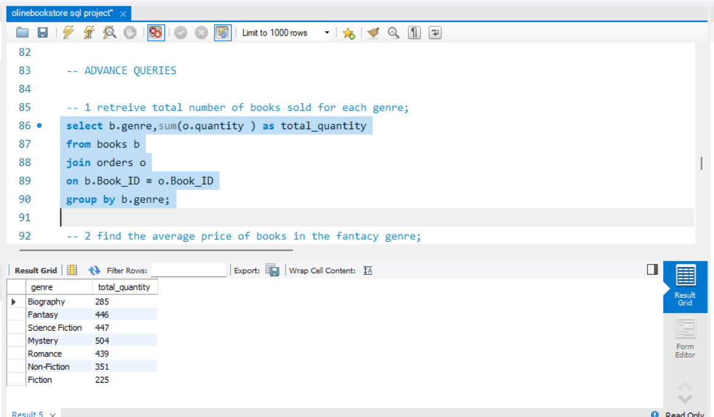
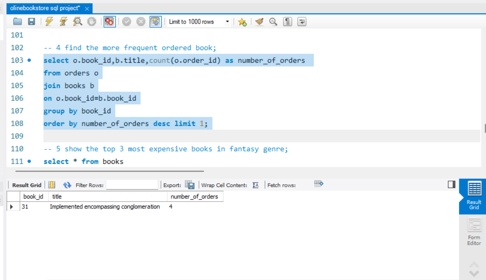
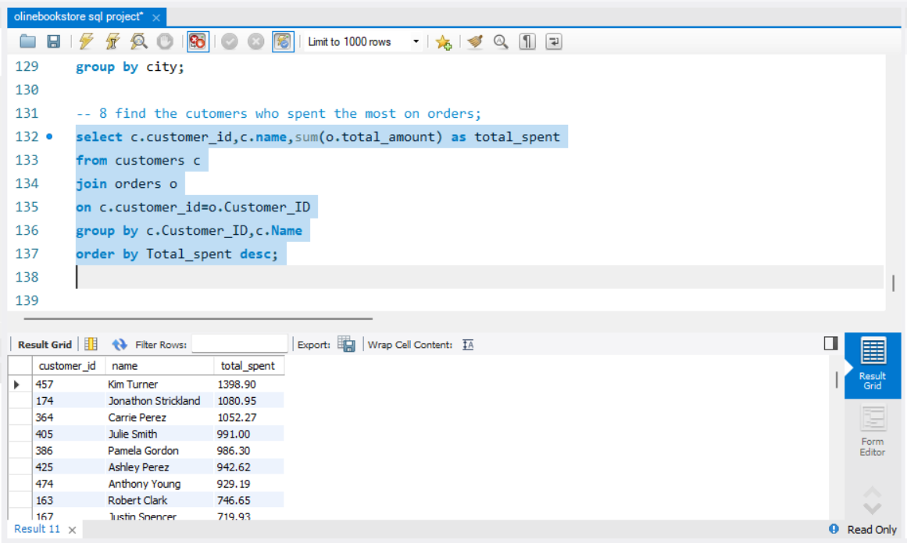

#  Online Bookstore SQL Project

##  Overview

This project demonstrates SQL skills by designing and querying a relational database for an online bookstore. It includes database creation, data handling, and analysis using SQL queries.

---

##  Database Structure

The project consists of three main tables:

* **Books** → Stores book details such as title, author, genre, price, and stock
* **Customers** → Stores customer information like name, email, and location
* **Orders** → Stores transaction details including purchased books, quantity, and total amount

---

##  Tools Used

* MySQL Workbench
* SQL

---

##  Key Features

* Relational database design using SQL
* Data analysis using JOIN operations
* Aggregations using SUM, COUNT, AVG
* Filtering and sorting data using WHERE, ORDER BY

---

##  Key Insights

* Identified most frequently ordered books
* Calculated total revenue generated from sales
* Found top customers based on spending
* Analyzed book sales by genre and author

---

##  Skills Demonstrated

* SQL Joins
* Aggregation Functions
* Group By & Having
* Data Analysis
* Relational Database Design

---

##  Project Structure

```
online-bookstore-sql/

── schema.sql        # Database and table creation
── queries.sql       # SQL queries for analysis
── README.md         # Project documentation
── data/             # Dataset files
     books.csv
     customers.csv
     orders.csv
```

---

##  How to Run

1. Open MySQL Workbench
2. Run `schema.sql` to create database and tables
3. Import CSV files into respective tables
4. Run `queries.sql` to perform analysis

---

##  Use Case

This project simulates a real-world bookstore system and demonstrates how SQL can be used for managing and analyzing business data.

##  Author
**Yash Bhola**

## 📸 Project Screenshots

###  Books Sold by Genre


---

###  Most Frequently Ordered Book


---

###  Top Customers by Spending

